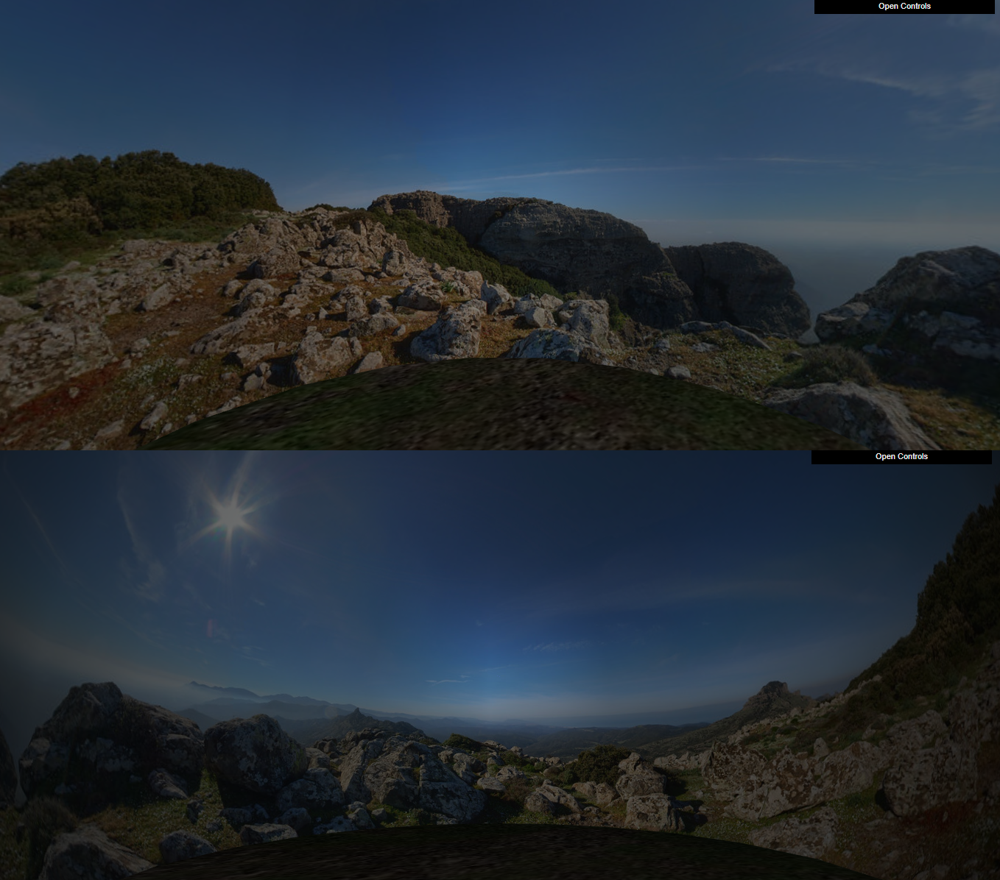
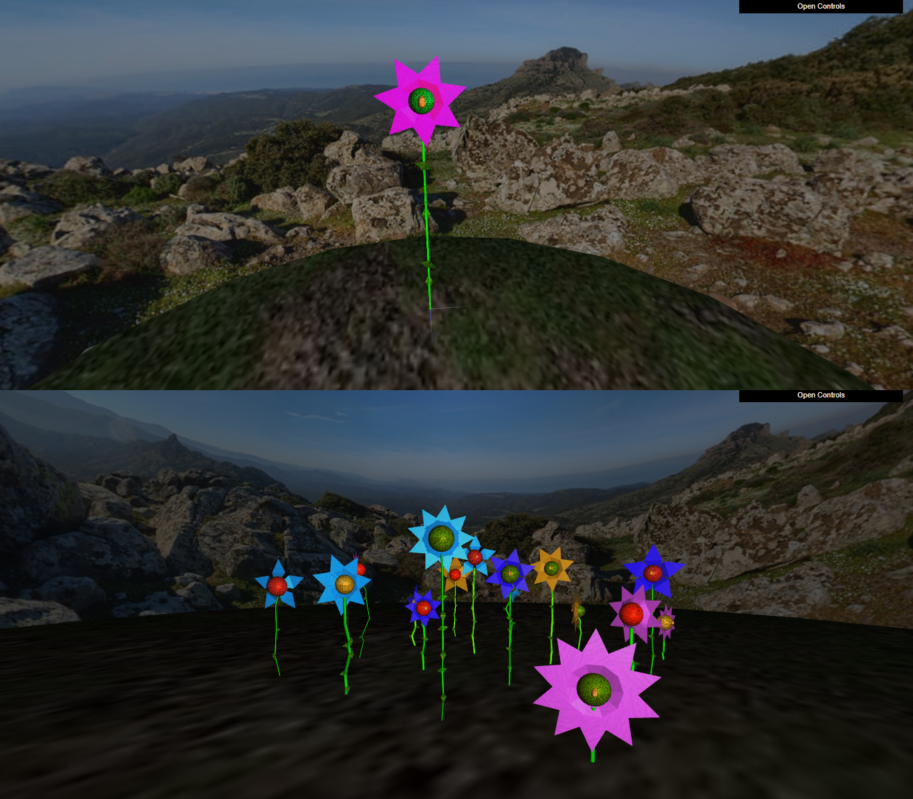
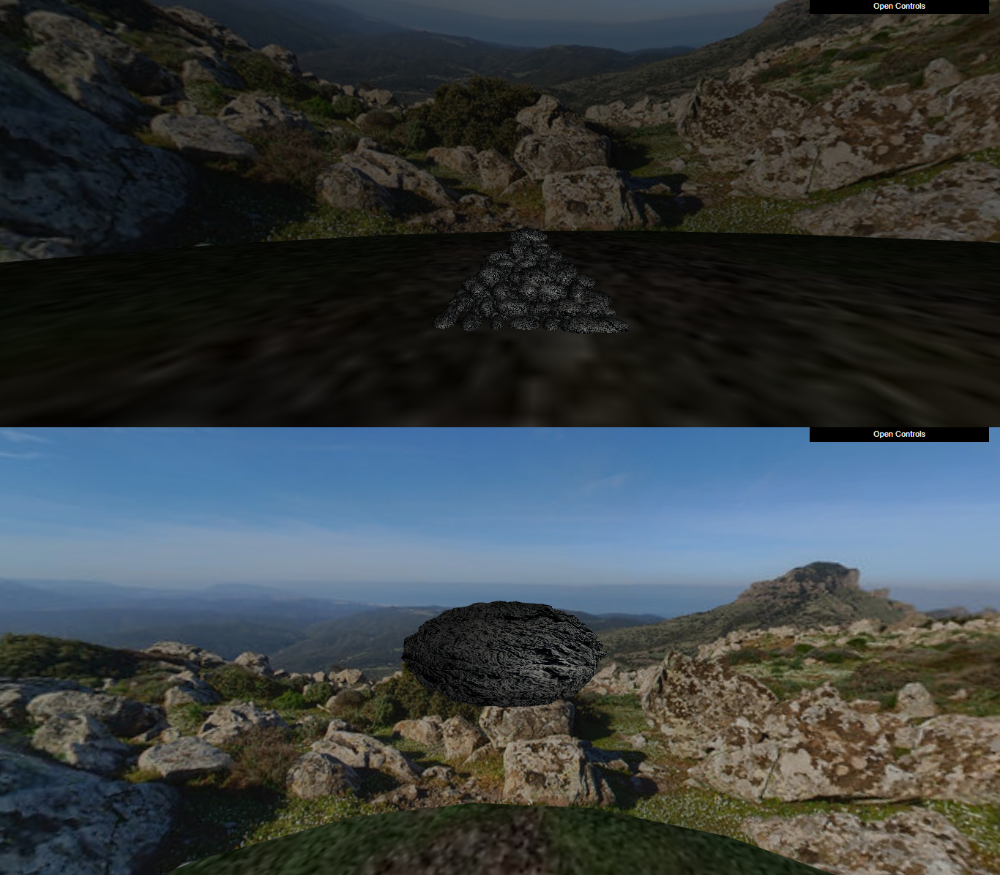
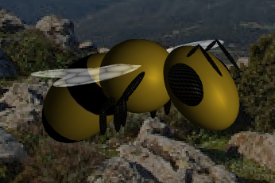
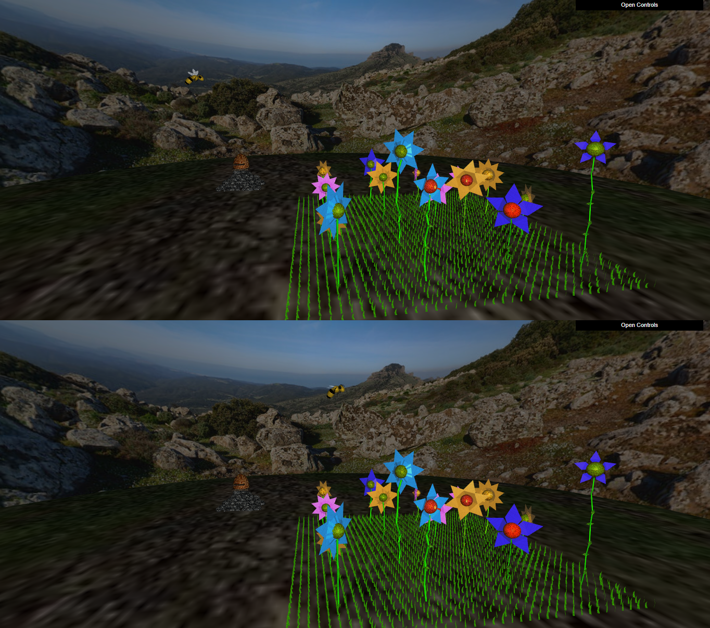
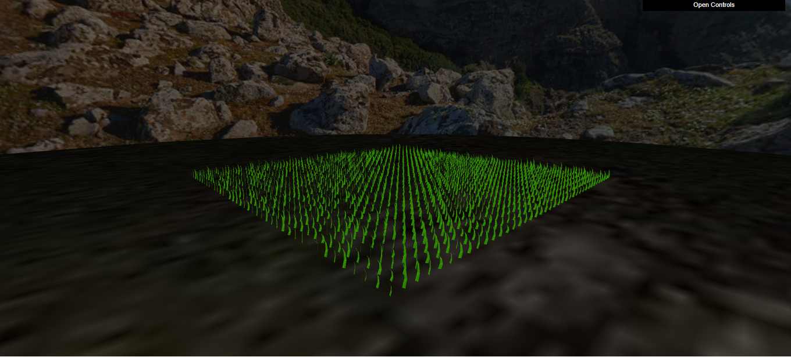

# Computação Gráfica 2023/24 - Projeto 

### Turma 06 - Grupo 12
- Francisco Campos - up202108735
- Henrique Pinheiro - up202108879

## Tópicos
### 1.2 Adição de Panoramas

### 2. Flores (Modelação, Parametrização e Texturização)

### 3. Pedras e penedos

### 4.1 Modelação da abelha

### 4.3 Controlo da abelha
A imagem demonstra a sequencia após se clicar em 'W' para começar o movimento na direção em que a abelha está virada, seguido de 'D' para rodar a abelha para a direita.

### 5. Pólen e colmeia
A imagem mostra a sequencia após se clicar em 'F' para a abelha descer quanto procura uma flor e para quando a encontra. 
Seguidamente clica-se em 'P' para a abelha apanhar o pólen e voltar ao movimento anteorior.
Por fim, clica-se em 'O' para a abelha depositar o pólen na colmeia.

### 6. Shaders e animação

### 7. Desenvolvimentos adicionais