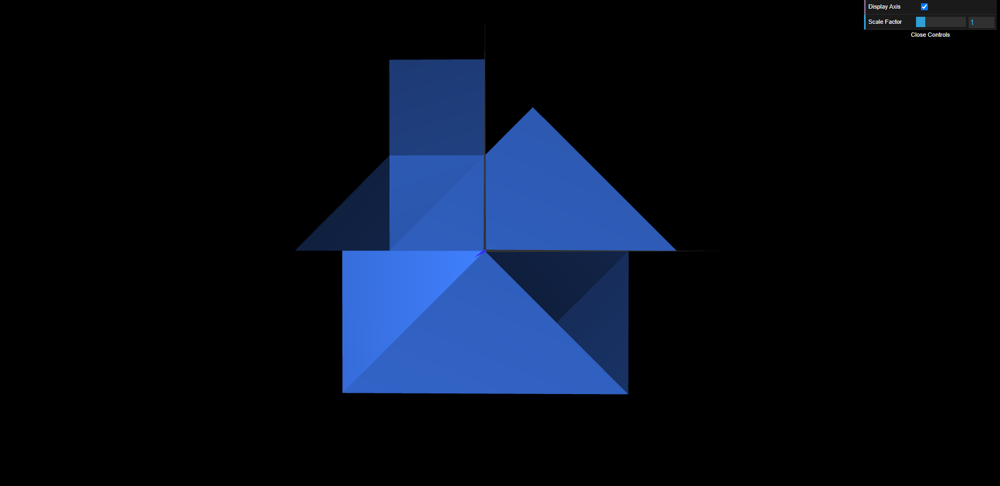
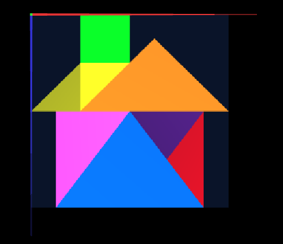

# CG 2023/2024

## Group T06G0y

## TP 2 Notes
### 2. Funções WebCGF para transformações geométricas
A única dificulade foi, inicialmente, perceber a ordem das transformações, uma vez que a ordem das mesmas é inversa à ordem em que são chamadas.

### 3. Geometria tridimensional - Cubo Unitário
Não houve dificuldades nesta parte.

### 4. Geometria composta - Cubo composto por planos
Não houve dificuldades nesta parte.
